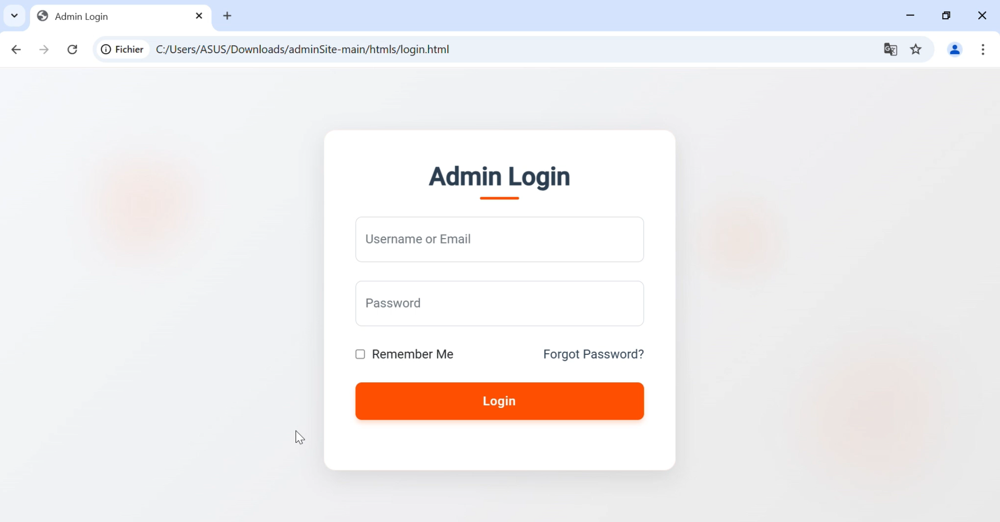
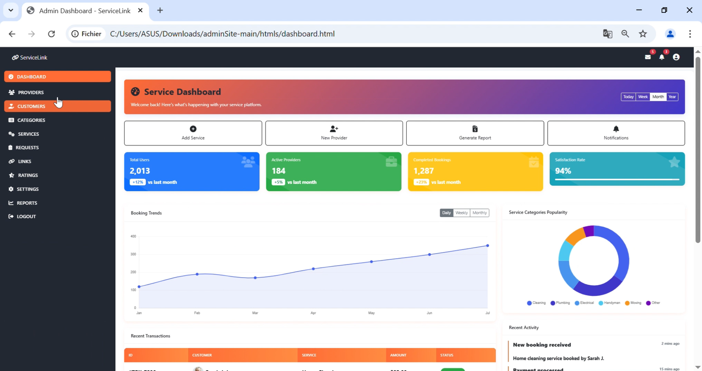
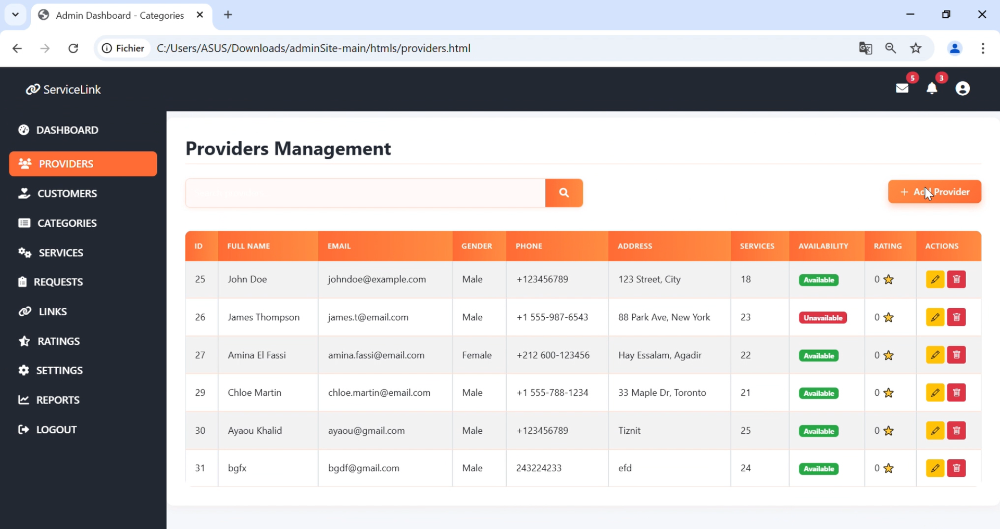
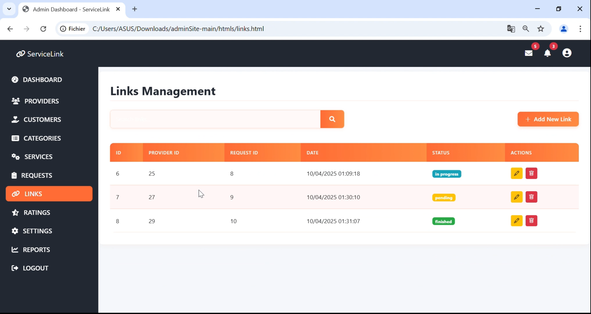
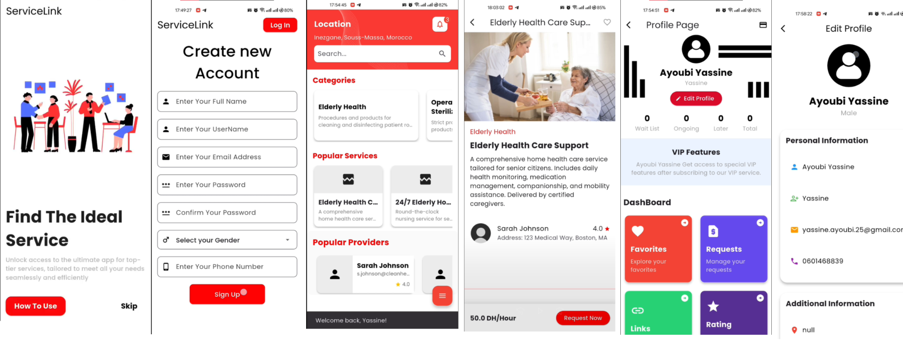

# ServiceLink

**Plateforme de mise en relation entre bénéficiaires et prestataires de services**


*Projet de Fin d'Études — 2025*


---

## 📋 Table des matières

- [À propos](#-à-propos)
- [Interface Web — Captures d'écran](#-interface-web--captures-décran)
- [Application Mobile — Captures d'écran](#-application-mobile--captures-décran)
- [Architecture technique](#-architecture-technique)
- [Fonctionnalités](#-fonctionnalités)
- [Installation](#-installation)
- [Structure du projet](#-structure-du-projet)
- [Équipe](#-équipe)

---

## 📖 À propos

**EaseLink** est une solution complète de mise en relation entre des **bénéficiaires** cherchant des services et des **prestataires** qualifiés. Le projet se compose de trois parties :

| Composant | Technologie | Description |
|-----------|-------------|-------------|
| 🔧 Back-End API | Django REST Framework | API REST sécurisée avec JWT, WebSocket, OTP |
| 📱 Application Mobile | Flutter (Dart) | App cross-platform pour les utilisateurs finaux |
| 🖥️ Tableau de Bord Web | HTML / CSS / JS | Interface d'administration complète |

---

## 🖥️ Interface Web — Captures d'écran


<p align="center">
  
  <br/>
  <em>Login Page</em>
</p>

<p align="center">
  
  <br/>
  <em>Dashboard</em>
</p>

<p align="center">
  
  <br/>
  <em>Providers</em>
</p>
<p align="center">
  
  <br/>
  <em>Links</em>
</p>

---

## 📱 Application Mobile — Captures d'écran


*Application mobile Flutter — ServiceLink*
<p align="center">
  
  <br/>
  <em>Application mobile - ServiceLink</em>
</p>

---

## 🏗️ Architecture technique

```
┌─────────────────────────────────────────────────────────┐
│                     CLIENT LAYER                        │
│   📱 Flutter App          🖥️  Web Dashboard             │
└───────────────────────┬─────────────────────────────────┘
                        │  HTTP / WebSocket
┌───────────────────────▼─────────────────────────────────┐
│                   BACKEND (Django)                       │
│  REST API  │  JWT Auth  │  WebSocket  │  OTP Mailing    │
└───────────────────────┬─────────────────────────────────┘
                        │
┌───────────────────────▼─────────────────────────────────┐
│                    DATABASE                              │
│                   PostgreSQL                             │
└─────────────────────────────────────────────────────────┘
```

### Back-End — Django REST Framework
- **Python 3 / Django 5** avec Django REST Framework
- **Authentification JWT** via `djangorestframework-simplejwt`
- **Notifications temps réel** via Django Channels (WebSocket)
- **Réinitialisation de mot de passe** par OTP (email)
- **Base de données** : PostgreSQL
- Gestion des rôles : utilisateur / administrateur

### Application Mobile — Flutter
- **Flutter SDK 3.5+** (Dart) — Android & iOS
- Requêtes HTTP via `http` et `dio`
- Géolocalisation avec `geolocator` & `geocoding`
- Calendrier de disponibilité avec `table_calendar`
- Persistance locale via `shared_preferences`

### Front-End Web — HTML/CSS/JS
- **Vanilla JavaScript** sans framework
- Pages CRUD complètes pour l'administration
- Dashboard analytique avec statistiques et graphiques
- Design responsive

---

## ✨ Fonctionnalités

### 👤 Authentification & Profil
- [x] Inscription / Connexion / Déconnexion
- [x] Réinitialisation du mot de passe par OTP (email)
- [x] Gestion du profil utilisateur (avatar, adresse, téléphone)
- [x] Rôles distincts : utilisateur final / administrateur

### 🛠️ Services & Catégories
- [x] Parcours des catégories et services disponibles
- [x] Services favoris (ajout / suppression)
- [x] Services populaires
- [x] Images associées aux services

### 📋 Demandes de Service
- [x] Création et suivi des demandes
- [x] Attribution de prestataires disponibles
- [x] Gestion des dates et disponibilités
- [x] Statuts de demande (en cours, terminé, annulé…)

### 👷 Prestataires
- [x] Profils détaillés des prestataires
- [x] Gestion de la disponibilité
- [x] Prestataires populaires
- [x] Recherche de prestataires disponibles

### 📊 Évaluations & Rapports
- [x] Système de notation et évaluation des prestataires
- [x] Signalement / rapports
- [x] Tableau de bord analytique (admin)

### 🔔 Notifications & Paiements
- [x] Notifications temps réel via WebSocket
- [x] Gestion des paiements liés aux demandes

---

## 🚀 Installation

### Prérequis
- Python 3.10+
- Flutter SDK 3.5+
- PostgreSQL

### Back-End (Django)

```bash
# Cloner le dépôt
git clone https://github.com/votre-org/easelink.git
cd easelink/Backend\ Django/Django

# Créer un environnement virtuel
python -m venv venv
source venv/bin/activate  # Windows : venv\Scripts\activate

# Installer les dépendances
pip install -r requirements.txt

# Configurer la base de données dans settings.py
# Appliquer les migrations
python manage.py migrate

# Créer un superutilisateur
python manage.py createsuperuser

# Lancer le serveur
python manage.py runserver
```

### Application Mobile (Flutter)

```bash
cd "Frontend application/Flutter_Y"

# Installer les dépendances
flutter pub get

# Lancer sur émulateur ou appareil connecté
flutter run
```

### Front-End Web

Ouvrir directement `Frontend Site web/htmls/login.html` dans un navigateur, ou servir avec un serveur HTTP local :

```bash
cd "Frontend Site web"
python -m http.server 8080
```

---

## 📁 Structure du projet

```
easelink/
├── Backend Django/
│   └── Django/
│       ├── api/
│       │   ├── models.py              # Modèles de données
│       │   ├── serializers.py         # Sérialiseurs DRF
│       │   ├── urls.py                # Routes API
│       │   ├── AuthenticationView.py  # Auth, OTP, reset
│       │   ├── userViews.py           # Vues utilisateur
│       │   ├── adminViews.py          # Vues admin
│       │   ├── consumers.py           # WebSocket
│       │   └── mailing.py             # Envoi d'emails
│       └── manage.py
│
├── Frontend application/
│   └── Flutter_Y/
│       ├── lib/                       # Code source Dart
│       ├── pubspec.yaml               # Dépendances Flutter
│       └── android/ ios/ web/         # Cibles de déploiement
│
├── Frontend Site web/
│   ├── htmls/                         # Pages HTML du dashboard
│   ├── js/                            # Logique JavaScript
│   └── styles/                        # Feuilles de style CSS
│
├── app_screenshots/
└── website_screenshots/
```

---

## 👥 Équipe

|[Back End Developer](./Backend%20Django/)|[Front End Developer](./Frontend%20Site%20Web/)| [Front End Developer](./Frontend%20application/)|
|:-------------------------:|:-------------------------:|:-------------------------:|
| |   |  | 
|[Dreuiche Mohamed](https://github.com/mdreuiche)| [Ait El Hadj Mohamed](https://github.com/medo495) | [Ayoubi Yassine](https://github.com/IIDOUY)|

---

> *Servicelink — Projet de Fin d'Études 2025* — **Dreuiche Mohamed · Ait El Hadj Mohamed · Yassine Ayoubi**


